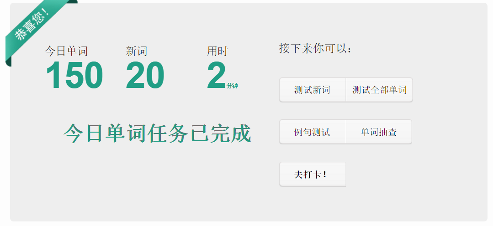

# I'm Lazy to finish the word test...

# Usage

1. 点击扇贝单词

2. 点击“开始学习”, 注意：需要在扇贝单词设置中选择 单词的目标掌握程度 为 “再认”

3. 打开`console`, 将`./dist/shanbay.build.js`的[代码](https://github.com/HeskeyBaozi/shanbay-auto-word-test/blob/master/dist/shanbay.build.js)粘贴到控制台并回车

4. 坐等自动完成

# How it woks ?

就是自动模拟鼠标点击 “单词认识” 然后自动点击 “下一个”